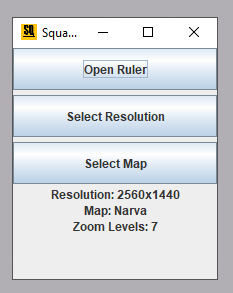
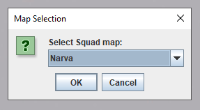
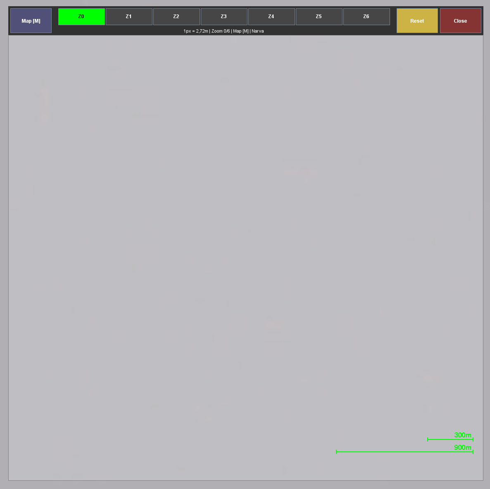
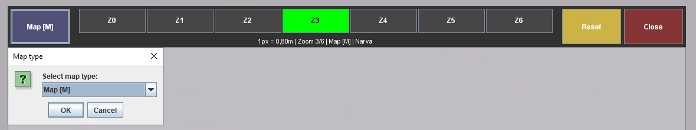
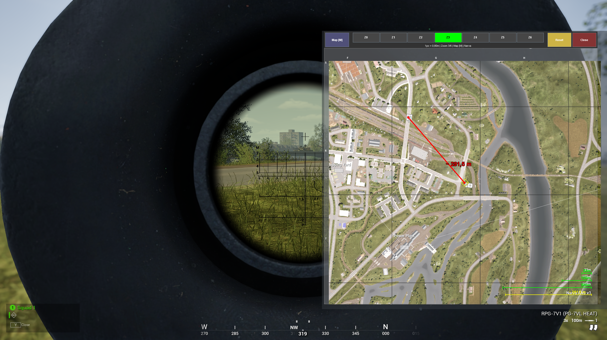
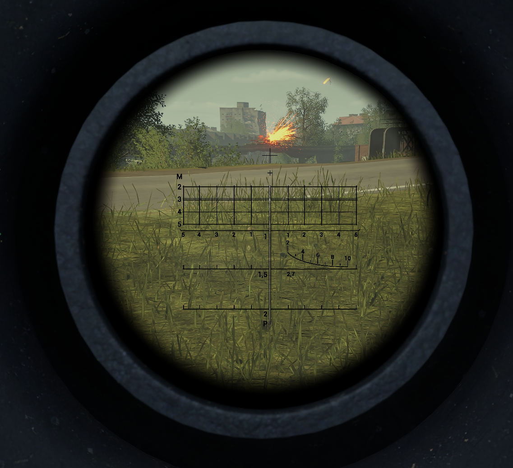
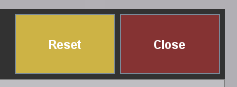

# Squad Distance Rule

This is a tool for measuring the distance between points on the map in the [Squad](https://store.steampowered.com/app/393380/Squad/) game.  
It will help you navigate better when playing with a hand-held or under-barrel grenade launcher, as a sniper or on a mortar.

This program does not access in-game data and is not a cheat. Measurements are made due to indirect signs: the number of rendered pixels in the scale line.

## Requirements
Java 17 or higher.  
Install the official Java version for your operating system from the manufacturer's website - https://www.oracle.com/java/technologies/downloads/  
In *Windows/Linux* You can find out the current Java version in the *command line/terminal*: `java -version`.

## Download
Download the latest version - https://github.com/mixmaxmax/Squad-Distance-Ruler/releases   
You can download only the executable file - `SquadDistanceRuler.jar`.  
Or download the entire project and build it yourself.

***
## Description
### 1. Run `SquadDistanceRuler.jar `.

### 2. In the main window of the program, select the resolution of your screen (the resolution of the game must be identical).

### 3. Also select a game map.

### 4. Open the overlay panel.

### 5. Use the buttons in the control panel to select the type of minimap and the zoom level.

Please note! There are three different minimaps in the game. By default, they are opened using the *M, CapsLock, Enter* buttons.  
Make sure that you have selected the appropriate type in the overlay.

You also need to know that there are different degrees of approximation of the minimap on different game maps.  
Unfortunately, the developers did not implement the approximation very explicitly. To set the appropriate zoom level, try to zoom in on the map in the game from the minimum level and with a time interval of 1 second. This way you can establish a correspondence between the game and the overlay.
### 6. Place the overlay on top of the game minimap so that you can set two points between which you want to measure the distance.

If you have chosen the zoom level and the type of minimap correctly, then the green scale overlay lines will be the same length as the in-game ones.
It is not necessary to position the overlay so that its scale lines are on top of the in-game ones. In the screenshot, this is done for clarity.

Use the mouse pointer to set two points on the map. Then a red line and a text with the measured distance will be drawn between them.

The yellow line shows the measured distance in parallel with the scale lines.

### 7. After finding out the distance, hit the target

### 8. Reset and Close buttons

The *Reset* button clears the overlay panel.

The *Close* button closes the overlay panel.
You can also close the overlay panel by pressing *Escape*.

***

# Supported maps and screen resolutions

| Map                     | 1920x1080  |  2560x1440 | 3840x2160  |
|:------------------------|:----------:|:-----------:|:----------:|
| Jensen's Range          | ✔️ | ✔️ |     ⚠️     |
| Al Basrah               | ✔️ | ✔️ |     ❌      |
| Anvil                   | ✔️ | ✔️ |     ❌      |
| Belaya Pass             | ❌ | ❌ |     ❌      |
| Black Coast             | ✔️ | ✔️ |     ❌      |
| Chora                   | ❌ | ❌ |     ❌      |
| Fallujah                | ✔️ | ✔️ |     ❌      |
| Fool's Road             | ✔️ | ✔️ |     ❌      |
| Goose Bay               | ✔️ | ✔️ |     ❌      |
| Gorodok                 | ✔️ | ✔️ |     ❌      |
| Harju                   | ❌ | ❌ |     ❌      |
| Kamdesh Highlands       | ❌ | ❌ |     ❌      |
| Kohat Toi               | ❌ | ❌ |     ❌      |
| Kokan                   | ❌ | ❌ |     ❌      |
| Lashkar Valley          | ❌ | ❌ |     ❌      |
| Logar Valley            | ❌ | ❌ |     ❌      |
| Manicougan              | ✔️ | ✔️ |     ❌      |
| Mestia                  | ❌ | ❌ |     ❌      |
| Mutaha                  | ✔️ | ✔️ |     ❌      |
| Narva                   | ✔️ | ✔️ |     ❌      |
| Pacific Proving Grounds | ❌ | ❌ |     ❌      |
| Sanxian Islands         | ✔️ | ✔️ |     ❌      |
| Skorpo                  | ❌ | ❌ |     ❌      |
| Sumari Bala             | ❌ | ❌ |     ❌      |
| Talil Outskirts         | ❌ | ❌ |     ❌      |
| Yegoryevka              | ✔️ | ✔️ |     ❌      |

Unfortunately, I don't have a native 4K screen to be able to add this resolution.

Adding support for new maps is possible in the future.